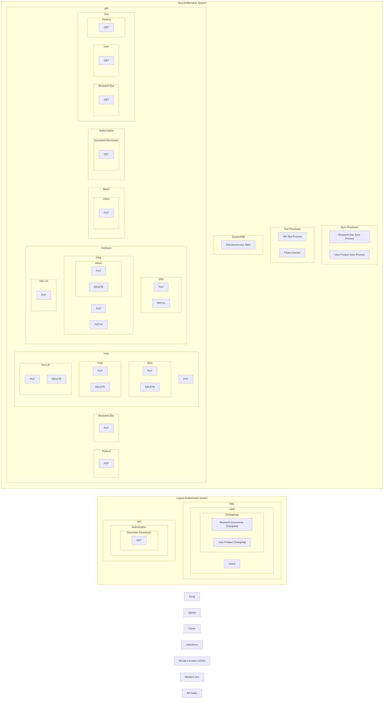

```mermaid
flowchart LR
    kong[Kong]
    
    splunk[Splunk]
    
    clover[Clover]
    
    sfdc[Salesforce]
    
    mac[Moody's Access Control]
    
    mdc[Moody's.com]
    
    sales[MA Sales]
    
    subgraph legacy-system[Legacy Entitlements System]
        subgraph sql[SQL]
            subgraph usd[USD]
            
                user-sql-table[Users]
                
                subgraph change-tables[Changelogs]
                    research-document-change-table[Research Documents Changelog]
                    user-product-change-table[User-Product Changelog]
                end
            end
        end
        
        subgraph legacy-api[API]
            subgraph legacy-authorization[Authorization]
                subgraph legacy-document-permission-authorization[Document Permission]
                    get-legacy-document-permission-endpoint[GET]
                end
            end
        end
    end
    
    subgraph new-system[New Entitlements System]
        subgraph sync-processes[Sync Processes]
            research-doc-sync-process[Research Doc Sync Process]
            user-product-sync-process[User-Product Sync Process]
        end
        
        subgraph test-processes[Test Processes]
            api-test-process[API Test Process]
            parity-checker[Parity Checker]
        end
        
        subgraph dynamodb[DynamoDB]
            mdc-user-access-table[MdcUserAccess Table]
        end
        
        subgraph new-world-api[API]
            subgraph product[Product]
                put-product-endpoint[PUT]
            end
            
            subgraph research-doc[Research Doc]
                put-research-doc-endpoint[PUT]
            end
            
            subgraph user[User]
                put-user-endpoint[PUT]
                
                subgraph user-dss-contract[DSS]
                    put-user-dss-contract-endpoint[PUT]
                    delete-user-dss-contract-endpoint[DELETE]
                end
                
                subgraph user-pss-contract[PSS]
                    put-user-pss-contract-endpoint[PUT]
                    delete-user-pss-contract-endpoint[DELETE]
                end
                
                subgraph user-doclib-contract[Doc Lib]
                    put-user-doclib-contract-endpoint[PUT]
                    delete-user-doclib-contract-endpoint[DELETE]
                end
            end
            
            subgraph contracts[Contracts]
                subgraph dss-contract[DSS]
                    put-dss-contract-endpoint[PUT]
                    patch-dss-contract-endpoint[PATCH]
                end
                
                subgraph pss-contract[PSS]
                    put-pss-contract-endpoint[PUT]
                    patch-pss-contract-endpoint[PATCH]
                    
                    subgraph pss-contract-issuer[Issuer]
                        put-pss-contract-issuer-endpoint[PUT]
                        delete-pss-contract-issuer-endpoint[DELETE]
                    end
                end
                
                subgraph doclib-contract[Doc Lib]
                    put-doclib-contract-endpoint[PUT]
                end
            end
            
            subgraph batch[Batch]
                subgraph batch-users[Users]
                    put-batch-users-endpoint[PUT]
                end
            end
            
            subgraph new-authorization[Authorization]
                subgraph new-document-permission-authorization[Document Permission]
                    get-new-document-permission-endpoint[GET]
                end
            end
            
            subgraph test[Test]
                subgraph test-research-doc[Research Doc]
                    get-test-research-doc-endpoint[GET]
                end
                
                subgraph test-user[User]
                    get-test-user-endpoint[GET]
                end
                
                subgraph test-product[Product]
                    get-test-product-endpoint[GET]
                end
            end
        end
    end
```